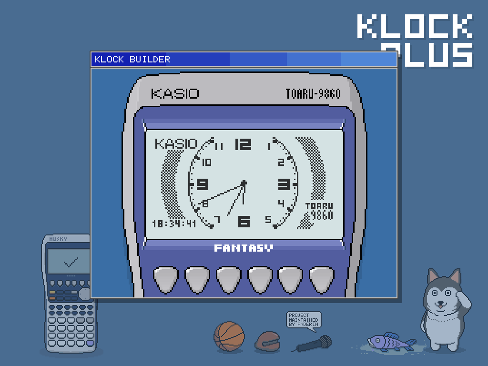
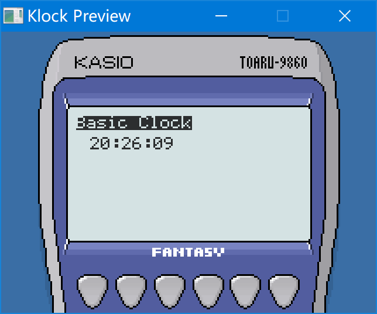

# Klock Plus



Klock Plus 是一个时钟App展示工具，可以运行在PC / CASIO fx-9860 / WinCE等平台上。

并且可以在PC上构建用户自定义的表盘。

此项目按照 BSD 协议开源。

## 安装

### 在fx-9860系列上安装

将`KLOCKP.G1A`安装在 Flash Mem，并将需要展示的表盘文件 `*.kwf` 放置在 Flash Mem 或者 SD Card，启动程序即可展示。

### 在 Windows CE 上安装

`TODO`

## 制作自定义表盘

用户可以自己编写 `KBasic Script`并且使用`KlockPlus Builder`来构建`KWF`格式的表盘。

### 关于 KBasic

KBasic 是一种表达绘制流程的简单脚本语言，使用Builder构建，编译为KRT字节码（一个简单的基于堆栈的虚拟机）。

表盘 App 加载后，会后循环执行KBasic的代码，并且传入时、分、秒、毫秒等信息来执行绘制表盘，绘制的速度大约是 12 FPS。

### 样例

```
# 打印一句提示语
print(0, 0, "Basic Clock", 1)

# 拼接字符串，格式化时分秒
let str_time = zeropad(hh, 2) & ":" & zeropad(mm, 2) & ":" & zeropad(ss, 2)

# 打印时间字符串
print(8, 12, str_time, 0)
```

更多的样例请参考 `samples/`文件夹下的`kbs`文件。

### 构建表盘的二进制文件

1. 假设上面的样例保存为文件 `sample0-basic.kbs`。

2. 在命令行输入下面的命令来构建

   ```
   # -i 输入脚本文件名字
   # -o 输出二进制文件名
   # -d 可选选项，附加之后会打印调试信息
   klockbuilder build -i sample0-basic.kbs -o sample0.kwf
   ```

3. 输入以下的命令来预览

   ```
   # -i 输入二进制文件名字
   # -d 可选选项，附加之后会打印调试信息
   klockbuilder preview -i sample0.kwf
   ```

   当然，也可以选择直接双击 `klockbuilder.exe`，会弹出选择文件的对话框，选择文件来预览。



KBasic 有五种指令：

|      | 指令       | 样例                                                       | 功能                                  | 附注                                                         |
| ---- | ---------- | ---------------------------------------------------------- | ------------------------------------- | ------------------------------------------------------------ |
| 1    | image 指令 | `image "bitmap_file_name.bmp"`                             | 加载 bmp 格式的图片                   | 只接受色深为 24bit 的 bmp                                    |
| 2    | let 指令   | `let var_name = expr`                                      | 将 expr 的计算结果赋值给变量 var_name | 请注意，如果没有let在行首，会被理解为使用=（等于）操作符的表达式，并不会报错 |
| 3    | 标签指令   | `label_name:`                                              | 跳转标签                              |                                                              |
| 4    | goto 指令  | `goto label_name`                                          | 无条件跳转到指定标签                  |                                                              |
| 5    | if 指令    | `if expr goto label_name`                                  | expr 计算结果不为0时跳转到指定标签    |                                                              |
| 6    | 表达式     | `zeropad(hh, 2) & ":" & zeropad(mm, 2)` <br >`1+2/sin(ms)` | 可以计算的表达式                      |                                                              |

### 预定义变量

| 变量名 | 功能             | 附注                                                         |
| ------ | ---------------- | ------------------------------------------------------------ |
| `hh`   | 当前时间的小时   |                                                              |
| `mm`   | 当前时间的的分钟 |                                                              |
| `ss`   | 当前时间的秒     |                                                              |
| `ms`   | 当前时间的毫秒   | 受到 fx-9860 RTC 功能的限制，毫秒的精度是基于1/128秒的，需要注意。 |


### 表达式

表达式可以有两种值，字符串 `RVT_STRING` 与 数值`RVT_NUMBER`

### 表达式的操作符

| 优先级 | 操作符 | 功能       | 样例                     |
| ------ | ------ | ---------- | ------------------------ |
| 500    | -      | 取负数     | `-a` <br />`-1.5`        |
| 200    | *      | 乘法       | `a * b`                  |
| 200    | /      | 除法       | `a / b`                  |
| 200    | %      | 取模       | `a % b`                  |
| 200    | \      | 整数除法   | `a \ b`                  |
| 100    | +      | 加法       | `a + b`                  |
| 100    | -      | 减法       | `a - b`                  |
| 90     | &      | 字符串连接 | `"hello " & "world & 2"` |
| 60     | >      | 大于       | `a > b`                  |
| 60     | <      | 小于       | `a < b`                  |
| 60     | >=     | 大于等于   | `a >= b`                 |
| 60     | <=     | 小于等于   | `a <= b`                 |
| 50     | =      | 等于       | `a = b`                  |
| 50     | <>     | 不等于     | `a <> b`                 |
| 50     | !      | 逻辑非     | `!a`                     |
| 40     | &&     | 逻辑与     | `a && b`                 |
| 30     | \|\|   | 逻辑或     | `a || b`                 |

### 表达式支持的内建函数

| 函数标号 | 函数声明                       | 返回值       | 附注                                                         |
| -------- | ------------------------------ | ------------ | ------------------------------------------------------------ |
| 0        | sin(a)                         | `RVT_NUMBER` | 正弦                                                         |
| 1        | cos(a)                         | `RVT_NUMBER` | 余弦                                                         |
| 2        | tan(a)                         | `RVT_NUMBER` | 正切                                                         |
| 3        | sqrt(a)                        | `RVT_NUMBER` | 平方根                                                       |
| 4        | exp(a)                         | `RVT_NUMBER` | 指数                                                         |
| 5        | abs(a)                         | `RVT_NUMBER` | e为底的指数函数                                              |
| 6        | log(a)                         | `RVT_NUMBER` | 对数                                                         |
| 7        | rand()                         | `RVT_NUMBER` | 范围在区间`[0, 1)`的随机数                                   |
| 8        | clr()                          | `RVT_NUMBER` | 清除屏幕内容。总是返回 0                                     |
| 9        | zeropad(num, digits)           | `RVT_STRING` | 将数值转化为字符串，长度不足的时候在前方补充0                |
| 10       | printmini(x, y, str, rev)      | `RVT_NUMBER` | 打印字符串，字体尺寸4x6。总是返回 0                          |
| 11       | print(x, y, str, rev)          | `RVT_NUMBER` | 打印字符串，字体尺寸6x8。总是返回 0                          |
| 12       | gprint(x, y, str, image_index) | `RVT_NUMBER` | 将指定的图片当做包含字符`:`与字符`0-9`的字体，打印字符串<br />总是返回 0 |
| 13       | line(x0, y0, x1, y1, dot)      | `RVT_NUMBER` | 画线，dot为1是黑色，dot为0时白色。总是返回 0                 |
| 14       | blt(x, y, image_index)         | `RVT_NUMBER` | 在指定位置绘制图片。总是返回 0                               |
| 15       | p(expr)                        | `RVT_NUMBER` | 在控制台输出参数的内容，只在pc上有效。总是返回 0             |

## 其他

此项目的 `KlockPlus Builder` 使用了 [SDL](https://www.libsdl.org/)，并在分发时附带了 `SDL.dll`。如果想要自己修改、构建 `KlockPlus Builder`，需要在你的工具链中安装`SDL 1.2`。

此项目的字体使用了 [Portfolio 6x8](https://int10h.org/oldschool-pc-fonts/fontlist/font?portfolio_6x8) 与 [Tom Thumb 4x6](https://robey.lag.net/2010/01/23/tiny-monospace-font.html)。

此项目的吉祥物：狗大哈 · Husky The Big。[记得谢谢狗大哈](https://weibo.com/goudaha)！